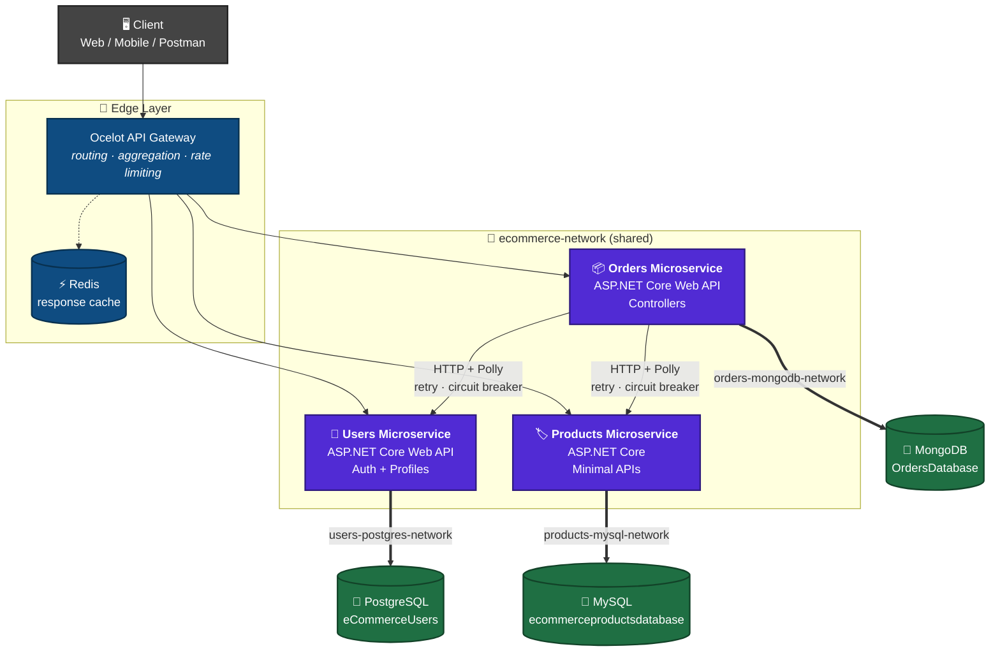
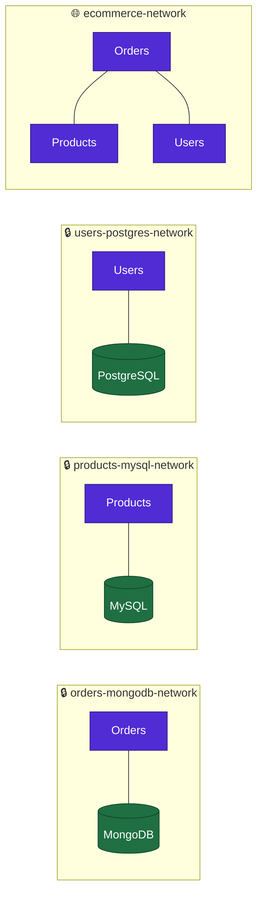
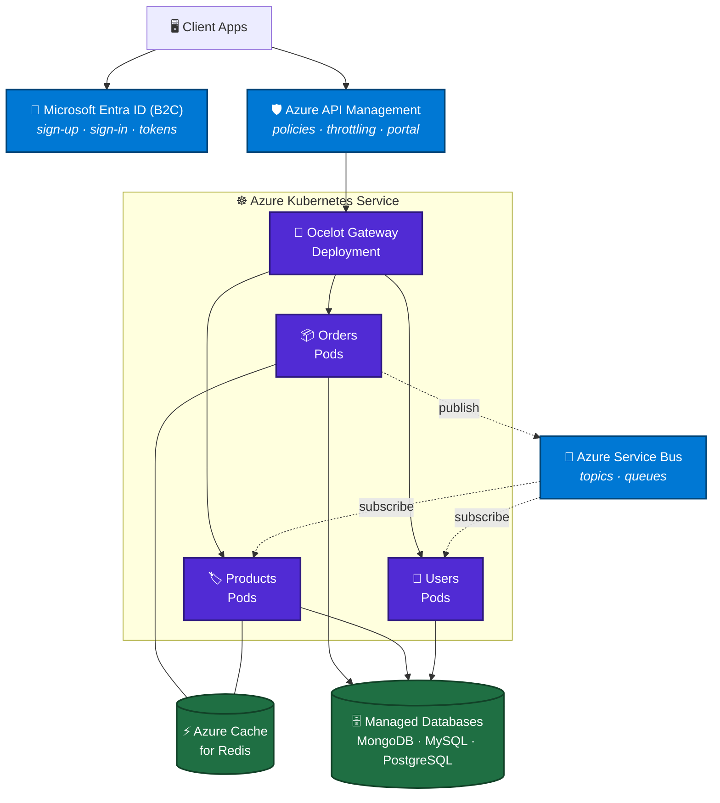

<div align="center">

# 🛒 eCommerce Microservices Application

**A production-style eCommerce backend built with C# / .NET, split into three independent microservices — each with its own database, its own container, and its own isolated Docker network.**


</div>

---

## 📑 Table of Contents

- [Overview](#-overview)
- [Architecture](#-architecture)
- [Tech Stack](#-tech-stack)
- [The Services](#-the-services)
- [How a Request Flows](#-how-a-request-flows)
- [API Reference](#-api-reference)
- [Getting Started](#-getting-started)
- [Configuration](#-configuration)
- [Docker Networks](#-docker-networks)
- [Roadmap](#-roadmap)
- [Target Cloud Architecture](#-target-cloud-architecture)
- [Repositories](#-repositories)

---

## 🎯 Overview

This solution breaks a typical eCommerce backend into three independently deployable services. Each one owns its data (database-per-service pattern), runs in its own container, and talks to the others only over the network — never through a shared database.

| | |
|---|---|
| 🧩 **3 microservices** | Products, Users, Orders |
| 🗄️ **3 databases** | MySQL, PostgreSQL, MongoDB — one per service |
| 🐳 **Fully containerized** | Services *and* databases, orchestrated with Docker Compose |
| 🔒 **Network isolation** | Each database sits on a private bridge network only its owner can reach |
| 🔗 **Service-to-service calls** | Orders composes data from Users and Products at request time |

---

## 🏗️ Architecture



> **Reading the diagram:** solid arrows between services are synchronous HTTP calls wrapped in Polly policies. Thick arrows are database connections that live on private networks — the Orders service physically cannot reach the Products database, and vice versa.

---

## 🧰 Tech Stack

| Area | Technologies |
|---|---|
| **Language & Runtime** |   |
| **API Styles** |    |
| **Databases** |    |
| **Validation & Mapping** |   |
| **Resilience** |  — wait & retry, circuit breaker, timeout, fallback |
| **Caching** |  |
| **API Gateway** |  |
| **Messaging** |   |
| **Containers** |   |
| **Orchestration** |   |
| **Identity** |  |
| **Cloud** |   |

---

## 🧩 The Services

| Service | Responsibility | Database | API Style | Local URL |
|---|---|---|---|---|
| 🏷️ **Products** | Product catalogue: CRUD, search by name/category |  | Minimal APIs | `http://localhost:6001` |
| 👤 **Users** | Registration, login, user lookup |  | Controllers | `http://localhost:5000` |
| 📦 **Orders** | Order lifecycle + orchestration across services |  | Controllers | `http://localhost:7000` |

**Orders is the hub.** When an order comes in, it calls Users to confirm who is buying and Products to confirm what is being bought, then persists the composed order document in MongoDB.

---

<!-- ## 🔄 How a Request Flows

```mermaid
sequenceDiagram
    autonumber
    participant C as 🖥️ Client
    participant G as 🚪 Ocelot Gateway
    participant O as 📦 Orders Service
    participant U as 👤 Users Service
    participant P as 🏷️ Products Service
    participant M as 🍃 MongoDB

    C->>G: POST /api/orders
    G->>O: route to orders-microservice
    O->>U: GET /api/users/:userID
    U-->>O: user profile
    O->>P: GET /api/products/search/product-id/:productID
    P-->>O: product details (name, price, category)
    Note over O,P: Polly wraps both calls —<br/>retry on transient faults,<br/>circuit breaker on repeated failure
    O->>M: insert order document
    M-->>O: acknowledged
    O-->>G: 201 Created + OrderResponse
    G-->>C: order confirmation
``` -->

---

## 📡 API Reference

<details open>
<summary><b>🏷️ Products Microservice</b> — <code>http://localhost:6001</code></summary>

| Method | Endpoint | Description |
|---|---|---|
| `GET` | `/api/products` | Get all products |
| `GET` | `/api/products/search/product-id/{productID}` | Get a single product by GUID |
| `GET` | `/api/products/search/{searchString}` | Search across product name **and** category |
| `POST` | `/api/products` | Add a product *(FluentValidation)* |
| `PUT` | `/api/products` | Update a product *(FluentValidation)* |
| `DELETE` | `/api/products/{productID}` | Delete a product |

Validation failures return `400` with an RFC 7807 `ValidationProblem` payload grouped by property name.

</details>

<details open>
<summary><b>👤 Users Microservice</b> — <code>http://localhost:5000</code></summary>

| Method | Endpoint | Description |
|---|---|---|
| `POST` | `/api/auth/register` | Register a new user → `AuthenticationResponse` |
| `POST` | `/api/auth/login` | Authenticate → `AuthenticationResponse` |
| `GET` | `/api/users/{userID}` | Fetch a user profile by GUID |

`/api/users/{userID}` is the endpoint the Orders service calls internally during checkout.

</details>

<details open>
<summary><b>📦 Orders Microservice</b> — <code>http://localhost:7000</code></summary>

| Method | Endpoint | Description |
|---|---|---|
| `GET` | `/api/orders` | Get all orders |
| `GET` | `/api/orders/search/orderid/{orderID}` | Get an order by ID |
| `GET` | `/api/orders/search/productid/{productID}` | All orders containing a given product |
| `GET` | `/api/orders/search/userid/{userID}` | All orders placed by a given user |
| `GET` | `/api/orders/search/orderDate/{orderDate}` | All orders for a date (`yyyy-MM-dd`) |
| `POST` | `/api/orders` | Place a new order |
| `PUT` | `/api/orders/{orderID}` | Update an order |
| `DELETE` | `/api/orders/{orderID}` | Delete an order |

</details>

### Quick smoke test

```bash
# List products
curl http://localhost:6001/api/products

# Register a user
curl -X POST http://localhost:5000/api/auth/register \
  -H "Content-Type: application/json" \
  -d '{"email":"demo@example.com","password":"P@ssw0rd!","personName":"Demo User","gender":"Male"}'

# List orders
curl http://localhost:7000/api/orders
```

---

## 🚀 Getting Started

### Prerequisites

| Requirement | Notes |
|---|---|
|  | With Docker Compose v2 |
|  | Only needed to run services outside containers |

### 1. Clone the three services side by side

```bash
git clone https://github.com/sayanpr8175/eCommerceSolution.ProductsService.git
git clone https://github.com/sayanpr8175/eCommerceSolution.UsersService.git
git clone https://github.com/sayanpr8175/eCommerceSolution.OrdersService.git
```

### 2. Build the service images

The Compose file references pre-built images for Products and Users, so build those first:

```bash
docker build -t products-microservice:latest ./eCommerceSolution.ProductsService
docker build -t users-microservice:latest   ./eCommerceSolution.UsersService
```

### 3. Bring the whole stack up

```bash
docker compose up -d --build
```

### 4. Verify

```bash
docker compose ps
```

| Container | Host port | Purpose |
|---|---|---|
| `ordersmicroservice.api` | `7000` | Orders API |
| `products-microservice` | `6001` | Products API |
| `users-microservice` | `5000` | Users API |
| `mongodb-container` | `27017` | Orders data |
| `mysql-container` | `3307` | Products data |
| `postgres-container` | `5433` | Users data |

Seed scripts placed in `./mongodb-scripts`, `./mysql-scripts`, and `./postgres-scripts` are mounted into each database's `docker-entrypoint-initdb.d` and run automatically on first start.

<details>
<summary>📄 <b>View the full docker-compose.yml</b></summary>

```yaml
services:
  ordersmicroservice.api:
    image: ordersmicroserviceapi
    build:
      context: .
      dockerfile: OrdersMicroservice.API/Dockerfile
    environment:
      - ASPNETCORE_ENVIRONMENT=Development
      - MONGODB_HOST=mongodb-container
      - MONGODB_PORT=27017
      - MONGODB_DATABASE=OrdersDatabase
      - UsersMicroserviceName=users-microservice
      - UsersMicroservicePort=9090
      - ProductsMicroserviceName=products-microservice
      - ProductsMicroservicePort=8080
    ports:
      - "7000:8080"
    networks:
      - orders-mongodb-network
      - ecommerce-network
    depends_on:
      - mongodb-container

  mongodb-container:
    image: mongo:latest
    ports:
      - "27017:27017"
    volumes:
      - ./mongodb-scripts:/docker-entrypoint-initdb.d
    networks:
      - orders-mongodb-network

  products-microservice:
    image: products-microservice:latest
    environment:
      - ASPNETCORE_HTTP_PORTS=8080
      - ASPNETCORE_ENVIRONMENT=Development
      - MYSQL_HOST=mysql-container
      - MYSQL_PORT=3306
      - MYSQL_DATABASE=ecommerceproductsdatabase
      - MYSQL_USER=root
      - MYSQL_PASSWORD=admin
    ports:
      - "6001:8080"
    networks:
      - products-mysql-network
      - ecommerce-network
    depends_on:
      - mysql-container

  mysql-container:
    image: mysql:latest
    environment:
      - MYSQL_ROOT_PASSWORD=admin
    ports:
      - "3307:3306"
    volumes:
      - ./mysql-scripts:/docker-entrypoint-initdb.d
    networks:
      - products-mysql-network

  users-microservice:
    image: users-microservice:latest
    environment:
      - ASPNETCORE_HTTP_PORTS=9090
      - ASPNETCORE_ENVIRONMENT=Development
      - POSTGRES_HOST=postgres-container
      - POSTGRES_PORT=5432
      - POSTGRES_USER=postgres
      - POSTGRES_PASSWORD=admin
    ports:
      - "5000:9090"
    networks:
      - users-postgres-network
      - ecommerce-network
    depends_on:
      - postgres-container

  postgres-container:
    image: postgres:13
    environment:
      - POSTGRES_USER=postgres
      - POSTGRES_PASSWORD=admin
      - POSTGRES_DB=eCommerceUsers
    ports:
      - "5433:5432"
    volumes:
      - ./postgres-scripts:/docker-entrypoint-initdb.d
    networks:
      - users-postgres-network

networks:
  orders-mongodb-network:
    driver: bridge
  products-mysql-network:
    driver: bridge
  users-postgres-network:
    driver: bridge
  ecommerce-network:
    driver: bridge
```

</details>

---

## ⚙️ Configuration

Every service is configured entirely through environment variables — no connection strings baked into images.

<details>
<summary><b>📦 Orders Microservice</b></summary>

| Variable | Example | Purpose |
|---|---|---|
| `MONGODB_HOST` | `mongodb-container` | MongoDB service name on the Docker network |
| `MONGODB_PORT` | `27017` | MongoDB port |
| `MONGODB_DATABASE` | `OrdersDatabase` | Database name |
| `UsersMicroserviceName` | `users-microservice` | DNS name used for internal calls |
| `UsersMicroservicePort` | `9090` | Users container port |
| `ProductsMicroserviceName` | `products-microservice` | DNS name used for internal calls |
| `ProductsMicroservicePort` | `8080` | Products container port |

</details>

<details>
<summary><b>🏷️ Products Microservice</b></summary>

| Variable | Example |
|---|---|
| `MYSQL_HOST` | `mysql-container` |
| `MYSQL_PORT` | `3306` |
| `MYSQL_DATABASE` | `ecommerceproductsdatabase` |
| `MYSQL_USER` | `root` |
| `MYSQL_PASSWORD` | `admin` |

</details>

<details>
<summary><b>👤 Users Microservice</b></summary>

| Variable | Example |
|---|---|
| `POSTGRES_HOST` | `postgres-container` |
| `POSTGRES_PORT` | `5432` |
| `POSTGRES_USER` | `postgres` |
| `POSTGRES_PASSWORD` | `admin` |
| `POSTGRES_DB` | `eCommerceUsers` |

</details>

> ⚠️ The credentials above are local development defaults. Before deploying, move them to Azure Key Vault or Kubernetes secrets.

---

## 🕸️ Docker Networks

Four bridge networks enforce the boundaries between services:



| Network | Members | Why |
|---|---|---|
| `orders-mongodb-network` | Orders + MongoDB | Private data channel |
| `products-mysql-network` | Products + MySQL | Private data channel |
| `users-postgres-network` | Users + PostgreSQL | Private data channel |
| `ecommerce-network` | All three services | Service-to-service HTTP only |

Services resolve each other by container name via Docker's built-in DNS — no hard-coded IPs anywhere.

---

## 🗺️ Roadmap

### ✅ Done

- [x] Three independently deployable microservices
- [x] Database-per-service — MySQL, PostgreSQL, MongoDB
- [x] Clean layering (API → Business Logic → Data Access) in each service
- [x] FluentValidation on incoming requests
- [x] Synchronous service-to-service communication (Orders → Users / Products)
- [x] Full containerization of services **and** databases
- [x] Docker Compose orchestration with isolated bridge networks
- [x] Automatic database seeding via init scripts

### 🚧 In Progress

- [ ]  **Fault tolerance** — wait & retry, circuit breaker, timeout and fallback policies on all outbound HTTP calls
- [ ]  **Distributed caching** — cache product and user lookups to cut cross-service chatter
- [ ]  **API Gateway** — single entry point, routing, aggregation, rate limiting

### 📅 Planned

- [ ]  **Async messaging** — move order events off the request path into a message broker
- [ ]  **Azure Kubernetes Service** — deployments, services, ingress, HPA
- [ ]  **Managed messaging** in the cloud
- [ ]  **Identity** — externalize auth to Microsoft Entra ID (B2C)
- [ ]  **Azure API Management** — policies, throttling, developer portal

---

## ☁️ Target Cloud Architecture

Where this is heading once the Azure migration lands:



---

## 📂 Repositories

| Service | Repository |
|---|---|
| 🏷️ Products | [eCommerceSolution.ProductsService](https://github.com/sayanpr8175/eCommerceSolution.ProductsService) |
| 👤 Users | [eCommerceSolution.UsersService](https://github.com/sayanpr8175/eCommerceSolution.UsersService) |
| 📦 Orders | [eCommerceSolution.OrdersService](https://github.com/sayanpr8175/eCommerceSolution.OrdersService) |

---

<div align="center">

**Built with ❤️ and a lot of `docker compose up`**

⭐ Star the repos if this was useful to you

</div>