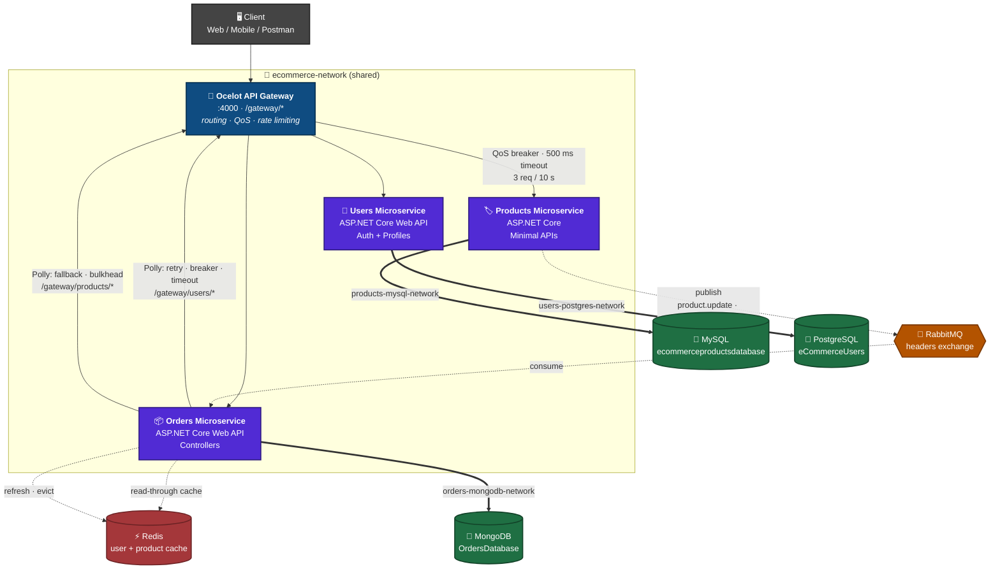
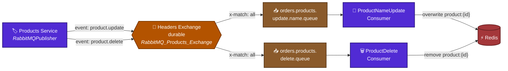
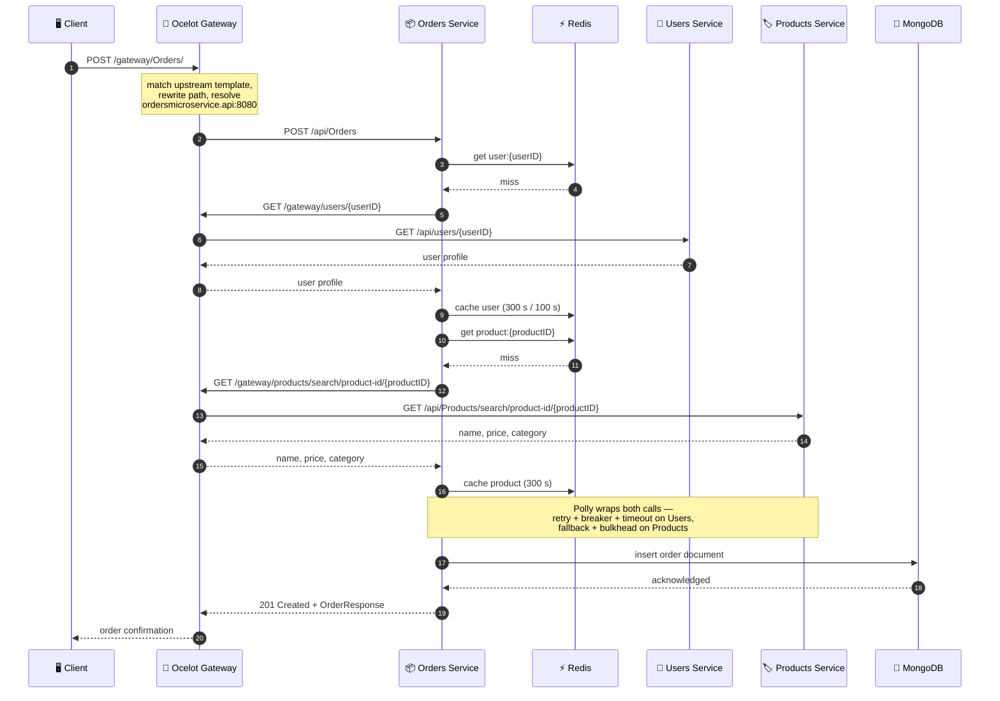
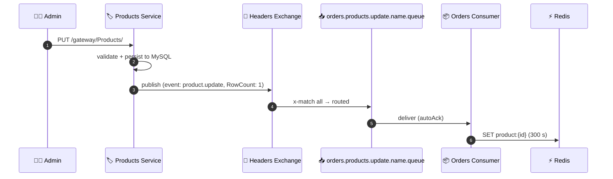
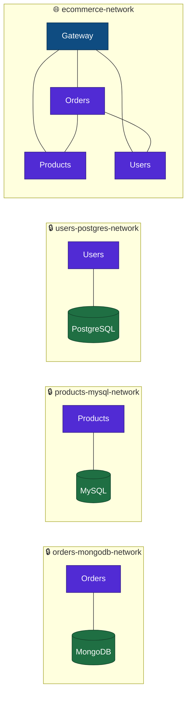
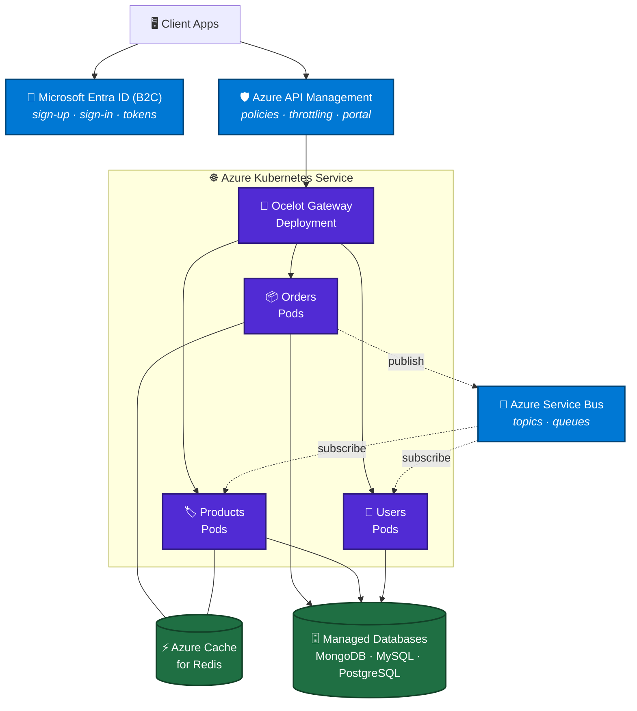

<div align="center">

# 🛒 eCommerce Microservices Application

**A production-style eCommerce backend built with C# / .NET, split into three independent microservices — each with its own database, its own container, and its own isolated Docker network — fronted by an Ocelot API Gateway.**


</div>

---

## 📂 All Repositories

| Component | Repository |
|---|---|
| 🚪 API Gateway | [eCommerceSolution.ApiGateway](https://github.com/sayanpr8175/eCommerceSolution.ApiGateway) |
| 🏷️ Products | [eCommerceSolution.ProductsService](https://github.com/sayanpr8175/eCommerceSolution.ProductsService) |
| 👤 Users | [eCommerceSolution.UsersService](https://github.com/sayanpr8175/eCommerceSolution.UsersService) |
| 📦 Orders | [eCommerceSolution.OrdersService - Main doc page](https://github.com/sayanpr8175/eCommerceSolution.OrdersService) |

---

## 📑 Table of Contents

- [Overview](#-overview)
- [Architecture](#-architecture)
- [Tech Stack](#-tech-stack)
- [The Services](#-the-services)
- [API Gateway](#-api-gateway)
- [Resilience & Caching](#-resilience--caching)
- [Event-Driven Messaging](#-event-driven-messaging)
- [How a Request Flows](#-how-a-request-flows)
- [API Reference](#-api-reference)
- [Getting Started](#-getting-started)
- [Configuration](#-configuration)
- [Docker Networks](#-docker-networks)
- [Roadmap](#-roadmap)
- [Target Cloud Architecture](#-target-cloud-architecture)

---

## 🎯 Overview

This solution breaks a typical eCommerce backend into three independently deployable services behind a single gateway. Each service owns its data (database-per-service pattern), runs in its own container, and talks to the others only over the network — never through a shared database.

| | |
|---|---|
| 🧩 **3 microservices** | Products, Users, Orders |
| 🚪 **1 API Gateway** | Ocelot — single entry point on port `4000`, all traffic under `/gateway/*` |
| 🗄️ **3 databases** | MySQL, PostgreSQL, MongoDB — one per service |
| 🐳 **Fully containerized** | Services *and* databases, orchestrated with Docker Compose |
| 🔒 **Network isolation** | Each database sits on a private bridge network only its owner can reach |
| 🔗 **Service-to-service calls** | Orders composes data from Users and Products at request time, through the gateway |
| 🛡️ **Fault tolerance** | Two layers — Polly policies inside Orders, plus Ocelot QoS at the edge |
| 🚦 **Rate limiting** | Enforced at the gateway on the Products collection route |
| ⚡ **Distributed caching** | Redis read-through cache in front of both cross-service lookups |
| 📨 **Event-driven messaging** | RabbitMQ headers exchange — Products publishes, Orders consumes and repairs its cache |

---

## 🏗️ Architecture



> **Reading the diagram:** the gateway is the only component exposed to clients, and it sits on `ecommerce-network` so it can resolve the three services by container name. Solid arrows are synchronous HTTP — note that Orders calls *back through the gateway* rather than hitting Users and Products directly, so there is one routing layer for everyone. Each of those calls carries its own Polly policy set; the two dependencies are protected differently, see [Resilience & Caching](#-resilience--caching). Dashed arrows are asynchronous or out-of-band: the Redis lookup that runs *before* either HTTP call, and the RabbitMQ events that keep the product cache current, see [Event-Driven Messaging](#-event-driven-messaging). Thick arrows are database connections that live on private networks — the Orders service physically cannot reach the Products database, and vice versa.

---

## 🧰 Tech Stack

| Area | Technologies |
|---|---|
| **Language & Runtime** |   |
| **API Styles** |    |
| **API Gateway** |   — routing, QoS, rate limiting |
| **Databases** |    |
| **Validation & Mapping** |   |
| **Resilience** |  — wait & retry, circuit breaker, timeout, fallback, bulkhead isolation |
| **Caching** |    |
| **Messaging** |  — headers exchange, two durable queues, hosted-service consumers ·  *(planned)* |
| **Containers** |   |
| **Orchestration** |   |
| **Identity** |  |
| **Cloud** |   |

---

## 🧩 The Services

| Service | Responsibility | Database | API Style | Container port | Direct URL |
|---|---|---|---|---|---|
| 🚪 **API Gateway** | Routing, QoS, rate limiting | — | Ocelot config | `8080` | `http://localhost:4000` |
| 🏷️ **Products** | Product catalogue: CRUD, search by name/category |  | Minimal APIs | `8080` | `http://localhost:6001` |
| 👤 **Users** | Registration, login, user lookup |  | Controllers | `9090` | `http://localhost:5000` |
| 📦 **Orders** | Order lifecycle + orchestration across services |  | Controllers | `8080` | `http://localhost:7000` |

**Orders is the hub.** When an order comes in, it calls Users to confirm who is buying and Products to confirm what is being bought, then persists the composed order document in MongoDB.

**The gateway is the front door.** The direct URLs above stay published for local debugging, but clients should go through `http://localhost:4000/gateway/...`.

---

## 🚪 API Gateway

A single ASP.NET Core host running [Ocelot](https://github.com/ThreeMammals/Ocelot) 23.4.3 with the Polly provider. There is no business logic in the gateway — the whole thing is configuration plus four lines of wiring.

```csharp
var builder = WebApplication.CreateBuilder(args);

builder.Configuration.AddJsonFile("ocelot.json", optional: false, reloadOnChange: true);
builder.Services.AddOcelot().AddPolly();

var app = builder.Build();
await app.UseOcelot();
app.Run();
```

`reloadOnChange: true` means route changes in `ocelot.json` are picked up without restarting the container.

### Route table

Every upstream path is namespaced under `/gateway/` and, as configured, ends with a trailing slash. Downstream hosts are Docker container names resolved over `ecommerce-network`.

<details open>
<summary><b>📦 Orders routes</b> → <code>ordersmicroservice.api:8080</code></summary>

| Methods | Upstream (gateway) | Downstream (service) |
|---|---|---|
| `GET` `POST` `OPTIONS` | `/gateway/Orders/` | `/api/Orders` |
| `GET` | `/gateway/Orders/search/orderid/{orderID}/` | `/api/Orders/search/orderid/{orderID}` |
| `GET` | `/gateway/Orders/search/productid/{productID}/` | `/api/Orders/search/productid/{productID}` |
| `GET` | `/gateway/Orders/search/userid/{userID}/` | `/api/Orders/search/userid/{userID}` |
| `GET` | `/gateway/Orders/search/orderDate/{orderDate}/` | `/api/Orders/search/orderDate/{orderDate}` |
| `PUT` `DELETE` `OPTIONS` | `/gateway/Orders/{orderID}/` | `/api/Orders/{orderID}` |

</details>

<details open>
<summary><b>🏷️ Products routes</b> → <code>products-microservice:8080</code></summary>

| Methods | Upstream (gateway) | Downstream (service) |
|---|---|---|
| `GET` `POST` `PUT` `OPTIONS` | `/gateway/Products/` | `/api/Products` |
| `GET` | `/gateway/Products/search/product-id/{productID}/` | `/api/Products/search/product-id/{productID}` |
| `GET` | `/gateway/Products/search/{searchString}/` | `/api/Products/search/{searchString}` |
| `DELETE` `OPTIONS` | `/gateway/Products/{productID}/` | `/api/Products/{productID}` |

</details>

<details open>
<summary><b>👤 Users routes</b> → <code>users-microservice:9090</code></summary>

| Methods | Upstream (gateway) | Downstream (service) |
|---|---|---|
| `POST` `OPTIONS` | `/gateway/Users/Auth/register/` | `/api/Auth/register` |
| `POST` `OPTIONS` | `/gateway/Users/Auth/login/` | `/api/Auth/login` |
| `GET` | `/gateway/Users/{userID}/` | `/api/users/{userID}` |

</details>

`OPTIONS` is declared on every mutating route so browser CORS preflight requests reach the downstream service instead of being rejected at the edge.

### Edge policies

Cross-cutting concerns are applied per route rather than globally, so a noisy endpoint can be protected without penalising the rest of the API. Today they sit on the Products collection route — the busiest read path.

| Route | Policy | Settings | Effect |
|---|---|---|---|
| `/gateway/Products/` | **QoS** *(Polly-backed)* | `ExceptionsAllowedBeforeBreaking: 3` · `DurationOfBreak: 1000` ms · `TimeoutValue: 500` ms | Circuit opens after 3 consecutive failures and stays open 1 s; any request slower than 500 ms is cut off |
| `/gateway/Products/` | **Rate limiting** | `Limit: 3` per `Period: 10s` · `PeriodTimespan: 5` · `HttpStatusCode: 429` | A 4th request inside a 10-second window gets `429 Too Many Requests`; the client should back off 5 s |

QoS is supplied by `Ocelot.Provider.Polly` — the `.AddPolly()` call in `Program.cs` is what activates it. Note that Ocelot's QoS `DurationOfBreak` and `TimeoutValue` are expressed in **milliseconds**, unlike the in-service Polly policies below which are configured in seconds.

### Two layers of resilience

The gateway and the Orders service both use Polly, but they guard different hops and are deliberately independent:

| | Gateway (Ocelot QoS) | Orders service (in-process Polly) |
|---|---|---|
| **Protects** | Client → downstream service | Orders → gateway → Users / Products |
| **Scope** | Per route, declarative in `ocelot.json` | Per HTTP client, composed in C# |
| **Fails as** | `503` / `429` from the edge | Placeholder DTO, order still completes |

A client hitting `/gateway/Products/` gets edge protection. An order placed through `/gateway/Orders/` gets edge routing *and* the internal Polly stack on the two calls Orders makes on its behalf.

---

## 🛡️ Resilience & Caching

Every outbound call from Orders is wrapped in Polly, and both cross-service lookups sit behind a Redis read-through cache. The two dependencies are deliberately protected in different ways.

### Policy matrix

| Outbound call | Policies | Configuration |
|---|---|---|
| **Orders → Users** | Retry → Circuit Breaker → Timeout | 5 retries, exponential backoff `2^n` seconds · breaker opens after 3 consecutive failures and stays open 2 minutes · 5 s timeout |
| **Orders → Products** | Fallback + Bulkhead Isolation | 2 concurrent requests, queue of 40 · fallback returns `503` carrying placeholder product JSON |

`UsersMicroservicePolicies.GetCombinedPolicy()` composes the first three with `Policy.WrapAsync(retry, circuitBreaker, timeout)`. Retry is outermost, so every attempt passes through the breaker and is individually bounded by the timeout — and a timeout counts as a failure the breaker can trip on.

Policies live behind interfaces so they can be reused and tested independently:

| Interface | Members |
|---|---|
| `IPollyPolicies` | `GetRetryPolicy(retryCount)`, `GetCircuitBreakerPolicy(handledEventsAllowedBeforeBreaking, durationOfBreak)`, `GetTimeoutPolicy(timeout)` |
| `IUsersMicroservicePolicies` | `GetCombinedPolicy()` |
| `IProductsMicroservicePolicies` | `GetFallBackPolicy()`, `GetBulkHeadIsolationPolicy()` |

### Degraded responses

An unhealthy dependency never takes the request down. Each failure mode is caught and answered with a placeholder DTO, so the order still completes:

| Condition | Caught as | What the caller sees |
|---|---|---|
| Breaker open (Users) | `BrokenCircuitException` | User fields read `Temporarily unavailable (Circuit breaker)` |
| Timeout (Users) | `TimeoutRejectedException` | User fields read `Temporarily unavailable (Timeout)` |
| Bulkhead queue full (Products) | `BulkheadRejectedException` | Product fields read `Services Unavailable (Bulkhead isolation blocked)` |
| Fallback fired | `503` from the fallback policy | Placeholder DTO deserialized from the fallback payload |
| Dependency returns `404` | — | `null`, surfaced as a normal not-found |
| Dependency returns `400` | — | `HttpRequestException` — a genuine client error is *not* masked |

### Redis cache

Both clients check Redis before making an HTTP call and populate it on the way back. Redis is wired up in `AddBusinessLogicLayer` via `AddStackExchangeRedisCache`, pointed at `REDIS_HOST:REDIS_PORT`.

| Key pattern | Value | Absolute TTL | Sliding TTL | Written by |
|---|---|---|---|---|
| `user:{userID}` | serialized `UserDTO` | 300 s | 100 s | HTTP read-through only |
| `product:{productID}` | serialized `ProductDTO` | 300 s | — | HTTP read-through **and** `product.update` events |

The product entry used to expire after 30 seconds, because Orders had no way to hear that a price or name had changed and a short window was the only defence. RabbitMQ removed that constraint: `product.update` overwrites the key and `product.delete` removes it, so freshness now comes from invalidation rather than from expiry, and the TTL could move out to 300 s. See [Event-Driven Messaging](#-event-driven-messaging).

Placeholder DTOs from any degraded path are returned but **never written to the cache**, so a brief outage cannot poison lookups for the rest of the TTL.

---

## 📨 Event-Driven Messaging

Product changes are broadcast rather than polled. The Products service publishes to a single RabbitMQ **headers exchange**; the Orders service runs two long-lived consumers that keep its Redis cache honest. Neither service knows the other exists — they only agree on a set of header values.

### Why a headers exchange

The project worked through direct and topic routing first; both are still visible as commented-out code next to the current calls. Headers won because routing is driven by typed key/value pairs instead of a dotted string, so a subscriber can match on several independent attributes without encoding them all into one routing key. Every publish uses `routingKey: string.Empty` — the headers *are* the routing.

### Topology



### Publishers

`RabbitMQPublisher` lives in the Products service and declares the exchange on every publish, so the topology is self-healing if the broker is reset.

| Trigger | Call | Headers | Payload |
|---|---|---|---|
| `ProductsService.UpdateProduct` | `Publish<Product>(headers, product)` | `event: product.update`, `RowCount: 1` | the full `Product` entity |
| `ProductsService.DeleteProduct` | `Publish<ProductDeleteMessage>(headers, message)` | `event: product.delete`, `RowCount: 1` | `ProductDeleteMessage(ProductID, ProductName)` |

Deletion publishes only when the repository confirms the row was actually removed. A second `Publish<T>(string routingKey, T message)` overload is kept for the direct-exchange approach the project started with; nothing calls it now.

### Bindings

| Queue | Binding arguments | `x-match` | Consumer |
|---|---|---|---|
| `orders.products.update.name.queue` | `event: product.update`, `RowCount: 1` | `all` | `RabbitMQProductNameUpdateConsumer` |
| `orders.products.delete.queue` | `event: product.delete`, `RowCount: 1` | `all` | `RabbitMQProductDeleteConsumer` |

`x-match: all` means every header in the binding must match before a message is delivered, so a `product.delete` message is never seen by the update queue. Both queues are declared `durable: true`, `exclusive: false`, `autoDelete: false` — they survive a broker restart and are not tied to one connection.

### Consumers

Both consumers implement `IDisposable` and are driven by an `IHostedService`, so they start with the application and tear down their channel and connection on shutdown. They are registered transient but resolved once by their hosted service, so a single instance lives for the lifetime of the process.

| Consumer | Deserializes to | Cache effect |
|---|---|---|
| `RabbitMQProductNameUpdateConsumer` | `ProductDTO` | `SetStringAsync("product:{id}", …)` with 300 s absolute expiry |
| `RabbitMQProductDeleteConsumer` | `ProductDeleteMessage` | `RemoveAsync("product:{id}")` |

Both consume with `autoAck: true`: the broker considers a message delivered the moment it hands it over, which keeps the consumer simple at the cost of losing a message if the handler throws.

### What this buys

A price change in the Products service reaches the Orders cache in milliseconds instead of waiting out a TTL, and a deleted product stops being served from cache immediately. Orders never polls, and the two services share no code — only the header contract.

---

## 🔄 How a Request Flows

Placing an order touches the gateway, all three services, Redis and MongoDB:



On a cache hit, Redis answers at the `get` step and everything up to the write-back is skipped — no gateway round-trip and no downstream call. Note that Orders talks to the gateway rather than to Users and Products directly, so its outbound calls take the same routing path as a client's.

Independently of any request, a `product.update` or `product.delete` event arriving from RabbitMQ rewrites or evicts `product:{productID}` out of band, so the next order sees fresh data without waiting out the TTL:



---

## 📡 API Reference

Two ways in: through the gateway (`http://localhost:4000/gateway/...`, the intended path) or directly against a service port (useful when debugging one service in isolation). The gateway equivalents are listed in [API Gateway](#-api-gateway).

<details open>
<summary><b>🚪 API Gateway</b> — <code>http://localhost:4000</code></summary>

| Method | Endpoint | Routes to |
|---|---|---|
| `GET` `POST` | `/gateway/Orders/` | Orders — list all / place an order |
| `GET` | `/gateway/Orders/search/orderid/{orderID}/` | Orders — by ID |
| `GET` | `/gateway/Orders/search/productid/{productID}/` | Orders — containing a product |
| `GET` | `/gateway/Orders/search/userid/{userID}/` | Orders — placed by a user |
| `GET` | `/gateway/Orders/search/orderDate/{orderDate}/` | Orders — by date (`yyyy-MM-dd`) |
| `PUT` `DELETE` | `/gateway/Orders/{orderID}/` | Orders — update / delete |
| `GET` `POST` `PUT` | `/gateway/Products/` | Products — list / add / update *(rate limited, QoS)* |
| `GET` | `/gateway/Products/search/product-id/{productID}/` | Products — by GUID |
| `GET` | `/gateway/Products/search/{searchString}/` | Products — search name and category |
| `DELETE` | `/gateway/Products/{productID}/` | Products — delete |
| `POST` | `/gateway/Users/Auth/register/` | Users — register |
| `POST` | `/gateway/Users/Auth/login/` | Users — login |
| `GET` | `/gateway/Users/{userID}/` | Users — profile by GUID |

</details>

<details>
<summary><b>🏷️ Products Microservice</b> — <code>http://localhost:6001</code></summary>

| Method | Endpoint | Description |
|---|---|---|
| `GET` | `/api/products` | Get all products |
| `GET` | `/api/products/search/product-id/{productID}` | Get a single product by GUID |
| `GET` | `/api/products/search/{searchString}` | Search across product name **and** category |
| `POST` | `/api/products` | Add a product *(FluentValidation)* |
| `PUT` | `/api/products` | Update a product *(FluentValidation)* |
| `DELETE` | `/api/products/{productID}` | Delete a product |

Validation failures return `400` with an RFC 7807 `ValidationProblem` payload grouped by property name.

</details>

<details>
<summary><b>👤 Users Microservice</b> — <code>http://localhost:5000</code></summary>

| Method | Endpoint | Description |
|---|---|---|
| `POST` | `/api/auth/register` | Register a new user → `AuthenticationResponse` |
| `POST` | `/api/auth/login` | Authenticate → `AuthenticationResponse` |
| `GET` | `/api/users/{userID}` | Fetch a user profile by GUID |

`/api/users/{userID}` is the endpoint the Orders service calls internally during checkout.

</details>

<details>
<summary><b>📦 Orders Microservice</b> — <code>http://localhost:7000</code></summary>

| Method | Endpoint | Description |
|---|---|---|
| `GET` | `/api/orders` | Get all orders |
| `GET` | `/api/orders/search/orderid/{orderID}` | Get an order by ID |
| `GET` | `/api/orders/search/productid/{productID}` | All orders containing a given product |
| `GET` | `/api/orders/search/userid/{userID}` | All orders placed by a given user |
| `GET` | `/api/orders/search/orderDate/{orderDate}` | All orders for a date (`yyyy-MM-dd`) |
| `POST` | `/api/orders` | Place a new order |
| `PUT` | `/api/orders/{orderID}` | Update an order |
| `DELETE` | `/api/orders/{orderID}` | Delete an order |

</details>

### Quick smoke test

All through the gateway. Keep the trailing slash — the upstream templates are configured with one.

```bash
# List products via the gateway
curl http://localhost:4000/gateway/Products/

# Register a user via the gateway
curl -X POST http://localhost:4000/gateway/Users/Auth/register/ \
  -H "Content-Type: application/json" \
  -d '{"email":"demo@example.com","password":"P@ssw0rd!","personName":"Demo User","gender":"Male"}'

# List orders via the gateway
curl http://localhost:4000/gateway/Orders/

# Trip the rate limiter — the 4th call inside 10s returns 429
for i in 1 2 3 4; do
  curl -s -o /dev/null -w "%{http_code}\n" http://localhost:4000/gateway/Products/
done
```

---

## 🚀 Getting Started

### Prerequisites

| Requirement | Notes |
|---|---|
|  | With Docker Compose v2 |
|  | Only needed to run services outside containers |

### 1. Clone the projects side by side

```bash
git clone https://github.com/sayanpr8175/eCommerceSolution.ApiGateway.git
git clone https://github.com/sayanpr8175/eCommerceSolution.ProductsService.git
git clone https://github.com/sayanpr8175/eCommerceSolution.UsersService.git
git clone https://github.com/sayanpr8175/eCommerceSolution.OrdersService.git
```

### 2. Build the service images

The Compose file references pre-built images for Products and Users, so build those first:

```bash
docker build -t products-microservice:latest ./eCommerceSolution.ProductsService
docker build -t users-microservice:latest   ./eCommerceSolution.UsersService
```

### 3. Bring the whole stack up

```bash
docker compose up -d --build
```

### 4. Verify

```bash
docker compose ps
curl http://localhost:4000/gateway/Products/
```

| Container | Host port | Purpose |
|---|---|---|
| `apigateway` | `4000` | Ocelot API Gateway — single entry point |
| `ordersmicroservice.api` | `7000` | Orders API |
| `products-microservice` | `6001` | Products API |
| `users-microservice` | `5000` | Users API |
| `mongodb-container` | `27017` | Orders data |
| `mysql-container` | `3307` | Products data |
| `postgres-container` | `5433` | Users data |

Seed scripts placed in `./mongodb-scripts`, `./mysql-scripts`, and `./postgres-scripts` are mounted into each database's `docker-entrypoint-initdb.d` and run automatically on first start.

<details>
<summary>📄 <b>View the full docker-compose.yml</b></summary>

```yaml
services:
  apigateway:
    image: apigateway:latest
    build:
      context: .
      dockerfile: ApiGateway/Dockerfile
    environment:
      - ASPNETCORE_ENVIRONMENT=Development
      - ASPNETCORE_HTTP_PORTS=8080
    ports:
      - "4000:8080"
    networks:
      - ecommerce-network
    depends_on:
      - ordersmicroservice.api
      - products-microservice
      - users-microservice

  ordersmicroservice.api:
    image: ordersmicroserviceapi
    build:
      context: .
      dockerfile: OrdersMicroservice.API/Dockerfile
    environment:
      - ASPNETCORE_ENVIRONMENT=Development
      - MONGODB_HOST=mongodb-container
      - MONGODB_PORT=27017
      - MONGODB_DATABASE=OrdersDatabase
      - UsersMicroserviceName=users-microservice
      - UsersMicroservicePort=9090
      - ProductsMicroserviceName=products-microservice
      - ProductsMicroservicePort=8080
    ports:
      - "7000:8080"
    networks:
      - orders-mongodb-network
      - ecommerce-network
    depends_on:
      - mongodb-container

  mongodb-container:
    image: mongo:latest
    ports:
      - "27017:27017"
    volumes:
      - ./mongodb-scripts:/docker-entrypoint-initdb.d
    networks:
      - orders-mongodb-network

  products-microservice:
    image: products-microservice:latest
    environment:
      - ASPNETCORE_HTTP_PORTS=8080
      - ASPNETCORE_ENVIRONMENT=Development
      - MYSQL_HOST=mysql-container
      - MYSQL_PORT=3306
      - MYSQL_DATABASE=ecommerceproductsdatabase
      - MYSQL_USER=root
      - MYSQL_PASSWORD=admin
    ports:
      - "6001:8080"
    networks:
      - products-mysql-network
      - ecommerce-network
    depends_on:
      - mysql-container

  mysql-container:
    image: mysql:latest
    environment:
      - MYSQL_ROOT_PASSWORD=admin
    ports:
      - "3307:3306"
    volumes:
      - ./mysql-scripts:/docker-entrypoint-initdb.d
    networks:
      - products-mysql-network

  users-microservice:
    image: users-microservice:latest
    environment:
      - ASPNETCORE_HTTP_PORTS=9090
      - ASPNETCORE_ENVIRONMENT=Development
      - POSTGRES_HOST=postgres-container
      - POSTGRES_PORT=5432
      - POSTGRES_USER=postgres
      - POSTGRES_PASSWORD=admin
    ports:
      - "5000:9090"
    networks:
      - users-postgres-network
      - ecommerce-network
    depends_on:
      - postgres-container

  postgres-container:
    image: postgres:13
    environment:
      - POSTGRES_USER=postgres
      - POSTGRES_PASSWORD=admin
      - POSTGRES_DB=eCommerceUsers
    ports:
      - "5433:5432"
    volumes:
      - ./postgres-scripts:/docker-entrypoint-initdb.d
    networks:
      - users-postgres-network

networks:
  orders-mongodb-network:
    driver: bridge
  products-mysql-network:
    driver: bridge
  users-postgres-network:
    driver: bridge
  ecommerce-network:
    driver: bridge
```

</details>

---

## ⚙️ Configuration

The three services are configured entirely through environment variables — no connection strings baked into images. The gateway is the exception: its routing lives in `ocelot.json`.

<details>
<summary><b>🚪 API Gateway</b></summary>

Routing is declarative, in `ocelot.json`, loaded at startup with `reloadOnChange: true`.

| Setting | Value | Purpose |
|---|---|---|
| `GlobalConfiguration.BaseUrl` | `http://localhost:4000` | The externally visible gateway address, used when Ocelot needs to build absolute URLs |
| `DownstreamHostAndPorts` | container names + internal ports | Resolved via Docker DNS on `ecommerce-network` |
| `UpstreamScheme` | `http` | Plain HTTP locally; terminate TLS at the edge before deploying |

Downstream targets, as configured:

| Service | Host | Port |
|---|---|---|
| Orders | `ordersmicroservice.api` | `8080` |
| Products | `products-microservice` | `8080` |
| Users | `users-microservice` | `9090` |

Because the hosts are container names, the gateway **must** run on `ecommerce-network`. Running it on the host machine instead will fail to resolve them.

</details>

<details>
<summary><b>📦 Orders Microservice</b></summary>

| Variable | Example | Purpose |
|---|---|---|
| `MONGODB_HOST` | `mongodb-container` | MongoDB service name on the Docker network |
| `MONGODB_PORT` | `27017` | MongoDB port |
| `MONGODB_DATABASE` | `OrdersDatabase` | Database name |
| `UsersMicroserviceName` | `users-microservice` | DNS name used for internal calls |
| `UsersMicroservicePort` | `9090` | Users container port |
| `ProductsMicroserviceName` | `products-microservice` | DNS name used for internal calls |
| `ProductsMicroservicePort` | `8080` | Products container port |
| `REDIS_HOST` | `redis-container` | Redis host — read by `AddStackExchangeRedisCache` |
| `REDIS_PORT` | `6379` | Redis port |
| `RabbitMQ_HostName` | `rabbitmq-container` | Broker host |
| `RabbitMQ_UserName` | `admin` | Broker user |
| `RabbitMQ_Password` | `admin` | Broker password |
| `RabbitMQ_Port` | `5672` | AMQP port |
| `RabbitMQ_Products_Exchange` | `products.exchange` | Headers exchange — **must be identical** to the value Products publishes to |

</details>

<details>
<summary><b>🏷️ Products Microservice</b></summary>

| Variable | Example |
|---|---|
| `MYSQL_HOST` | `mysql-container` |
| `MYSQL_PORT` | `3306` |
| `MYSQL_DATABASE` | `ecommerceproductsdatabase` |
| `MYSQL_USER` | `root` |
| `MYSQL_PASSWORD` | `admin` |
| `RabbitMQ_HostName` | `rabbitmq-container` |
| `RabbitMQ_UserName` | `admin` |
| `RabbitMQ_Password` | `admin` |
| `RabbitMQ_Port` | `5672` |
| `RabbitMQ_Products_Exchange` | `products.exchange` |

</details>

<details>
<summary><b>👤 Users Microservice</b></summary>

| Variable | Example |
|---|---|
| `POSTGRES_HOST` | `postgres-container` |
| `POSTGRES_PORT` | `5432` |
| `POSTGRES_USER` | `postgres` |
| `POSTGRES_PASSWORD` | `admin` |
| `POSTGRES_DB` | `eCommerceUsers` |

</details>

> ⚠️ The credentials above are local development defaults. Before deploying, move them to Azure Key Vault or Kubernetes secrets.

---

## 🕸️ Docker Networks

Four bridge networks enforce the boundaries between components:



| Network | Members | Why |
|---|---|---|
| `orders-mongodb-network` | Orders + MongoDB | Private data channel |
| `products-mysql-network` | Products + MySQL | Private data channel |
| `users-postgres-network` | Users + PostgreSQL | Private data channel |
| `ecommerce-network` | Gateway + all three services | Edge routing and service-to-service HTTP only |

Components resolve each other by container name via Docker's built-in DNS — no hard-coded IPs anywhere. The gateway is the only container whose port is meant to be published publicly; the per-service host ports exist for local debugging.

---

## 🗺️ Roadmap

### ✅ Done

- [x] Three independently deployable microservices
- [x] Database-per-service — MySQL, PostgreSQL, MongoDB
- [x] Clean layering (API → Business Logic → Data Access) in each service
- [x] FluentValidation on incoming requests
- [x] Synchronous service-to-service communication (Orders → Users / Products)
- [x] Full containerization of services **and** databases
- [x] Docker Compose orchestration with isolated bridge networks
- [x] Automatic database seeding via init scripts
- [x]  **Fault tolerance** — retry, circuit breaker and timeout on Users calls; fallback and bulkhead isolation on Products calls
- [x]  **Distributed caching** — read-through cache for user and product lookups, with per-entity TTLs
- [x] Graceful degradation — placeholder DTOs instead of thrown exceptions when a dependency is unhealthy
- [x]  **API Gateway** — single entry point on `:4000`, 13 routes across all three services, path rewriting, CORS preflight passthrough, hot-reloading config
- [x] **Edge QoS** — Polly-backed circuit breaker and timeout on the Products collection route
- [x] **Rate limiting** — 3 requests per 10 seconds on the Products collection route, `429` on breach
- [x] **Gateway response caching** — `FileCacheOptions` added
- [x]  **Event-driven messaging** — durable headers exchange, two bound queues, publisher in Products and hosted-service consumers in Orders
- [x] **Event-driven cache invalidation** — `product.update` overwrites the Redis entry, `product.delete` evicts it; product TTL relaxed from 30 s to 300 s as a result

### 📅 Planned

- [ ] **JWT authentication at the edge** — validate tokens in the gateway so downstream services stop re-authenticating
- [ ] **Order events** — publish `order.placed` so Products can adjust stock asynchronously, closing the loop in the other direction
- [ ] **Consumer durability** — manual acknowledgement and a dead-letter queue, so a failed handler does not silently drop a message
- [ ]  **Azure Kubernetes Service** — deployments, services, ingress, HPA
- [ ]  **Managed messaging** in the cloud
- [ ]  **Identity** — externalize auth to Microsoft Entra ID (B2C)
- [ ]  **Azure API Management** — policies, throttling, developer portal

---

## ☁️ Target Cloud Architecture

Where this is heading once the Azure migration lands:



The Ocelot gateway stays inside the cluster and Azure API Management fronts it, so subscription keys, quotas and the developer portal are handled by the platform while route-level QoS stays in `ocelot.json`.

---

<div align="center">

**Built with ❤️ and a lot of `docker compose up`**

⭐ Star the repos if this was useful to you

</div>